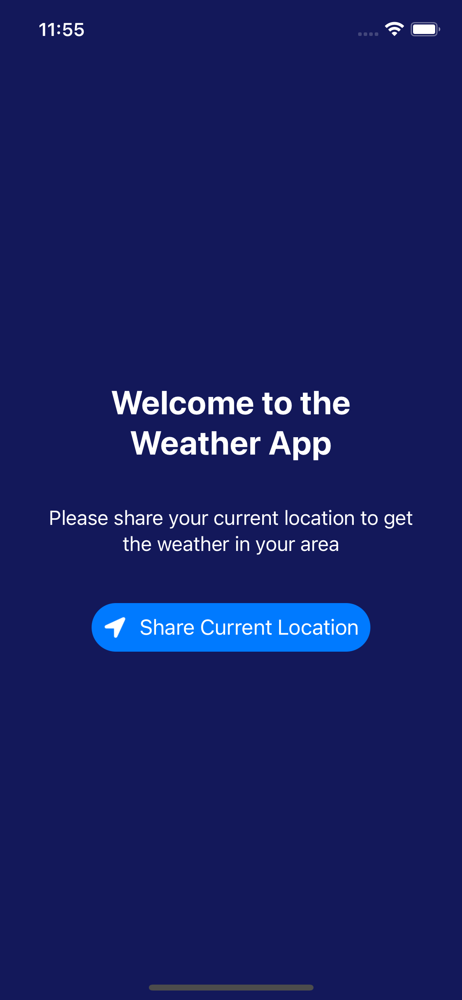
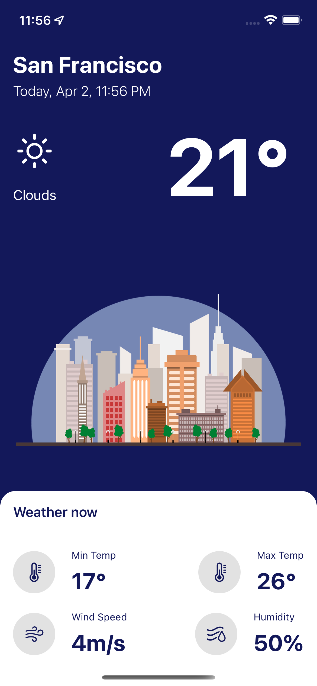

<h1>Swift Weather App</h1>

<h2>Screens: </h2>




<h2>Usage: </h2>

```bash

git clone https://github.com/universal-developer/Swift-Weather-App

xed Swift-Weather-App

```

<h2>Link on video: </h2>

```bash

https://www.youtube.com/watch?v=X2W9MPjrIbk

```
